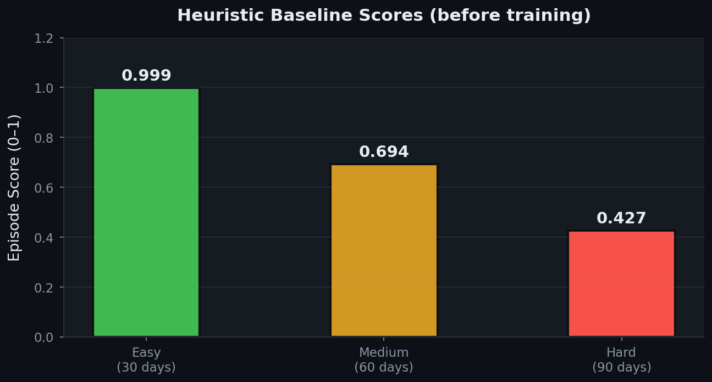

<div style="font-size:1.08rem;line-height:1.55;">

<div align="center">

# Financial Triage
<h3 style="font-size:1.35em;font-weight:600;margin:0.4em 0 0.2em;">Miss a payment here and the score drops.<br/>No explanation, no retry—same rule every time.</h3>
<p style="font-size:1.05em;margin:0.5em 0 1em;"><strong>OpenEnv · Hugging Face Space</strong></p>

[](https://huggingface.co/spaces/indra-dhanush/financial-triage-env)
[](https://colab.research.google.com/github/indra-2007/financial-triage-env/blob/main/financial_triage_training.ipynb)
[](https://pypi.org/project/openenv-core/)

</div>

**This is not a summary of your finances — it is a simulator that can still say no.** This is a day-by-day household-finance simulator in **INR**: you choose which bill eats cash first, when savings move, and which “fast money” offers to refuse. Every balance change follows code you can read and fight; outside citations only **frame** the story, while every rupee **inside** the run is synthetic, rule-bound, and reproducible. Slides reassure; this thing can still tell you **no**.

## Hackathon submission checklist (judges)

| Requirement | This repo |
|-------------|-----------|
| **OpenEnv (current PyPI line)** | Built on [`openenv-core[core] >= 0.2.3`](https://pypi.org/project/openenv-core/); `Environment` in `server/my_env_environment.py`, [`openenv.yaml`](openenv.yaml), `create_app` in `server/app.py`. |
| **Training in Colab (Unsloth + TRL)** | [Open in Colab](https://colab.research.google.com/github/indra-2007/financial-triage-env/blob/main/financial_triage_training.ipynb) · [`financial_triage_training.ipynb`](financial_triage_training.ipynb) (SFT + **GRPO** on live `env.step`). |
| **Experiment tracking** | Notebook sets `report_to='wandb'` when `WANDB_API_KEY` is set (Colab **Secrets** or shell); add your public **Weights & Biases** run URL in the [Materials](#judge-facing-links--materials) table after you train. |
| **Proof of training (loss + reward / score)** | [`training_loss_7b.png`](training_loss_7b.png) (SFT loss vs step) and [`before_after_scores_7b.png`](before_after_scores_7b.png) (heuristic vs SFT vs GRPO episode scores) embedded under [Training and the published figures](#training-and-the-published-figures). |
| **Write-up and/or short video (URLs only; no big files in Hub)** | [Links table](#judge-facing-links--materials) — [`MINI_BLOG.md`](MINI_BLOG.md) + [Hub view](https://huggingface.co/spaces/indra-dhanush/financial-triage-env/blob/main/MINI_BLOG.md); add **YouTube** (under 2 min) or **HF post** URL in that table when published. |
| **Runnable Space** | **[https://huggingface.co/spaces/indra-dhanush/financial-triage-env](https://huggingface.co/spaces/indra-dhanush/financial-triage-env)** (submit this URL). |

**Themes:** **#2** long-horizon (30/60/90 days) and **#3.1** economic world model (partial observability, INR)—see [Which hackathon themes this hits](#which-hackathon-themes-this-hits). **Rubric map:** [What each scoring criterion points to here](#what-each-scoring-criterion-points-to-here).

## Where to go in this document

| Skip to… | Section |
|----------|---------|
| The **reset / step / grade** loop and diagram | [What happens each day](#what-happens-each-day-reset-step-grade) |
| **Hackathon** track fit (#2 / #3.1) | [Which hackathon themes this hits](#which-hackathon-themes-this-hits) |
| **SFT + GRPO**, loss plot, bar chart | [Training and the published figures](#training-and-the-published-figures) |
| **Daily** reward sum vs **episode** grader | [How step reward is shaped](#how-step-reward-is-shaped) · [Episode grade](#episode-grade) |
| **Space**, Colab, `MINI_BLOG` | [Judge-facing links & materials](#judge-facing-links--materials) |

## Judge-facing links & materials

| What | Where |
|------|--------|
| **Live Space (submit this URL)** | [https://huggingface.co/spaces/indra-dhanush/financial-triage-env](https://huggingface.co/spaces/indra-dhanush/financial-triage-env) |
| **Colab training** (Unsloth + TRL; see [What this stack is](#what-this-stack-is)) | [Open in Colab](https://colab.research.google.com/github/indra-2007/financial-triage-env/blob/main/financial_triage_training.ipynb) — [`financial_triage_training.ipynb`](financial_triage_training.ipynb) |
| **Mini write-up** (in-repo; copy to [HF Posts](https://huggingface.co/posts/new) if you want a separate post) | [`MINI_BLOG.md`](MINI_BLOG.md) — [view on Hub](https://huggingface.co/spaces/indra-dhanush/financial-triage-env/blob/main/MINI_BLOG.md) |
| **Video (≤2 min, optional)** | *Add your public **YouTube** URL here after upload—do not commit video files to the Hub repo.* |
| **Slides / deck (optional)** | *Add a public **Google Slides / Notion / PDF** link if you use one for the pitch.* |
| **Experiment tracking (optional but recommended)** | With `WANDB_API_KEY` set, SFT and GRPO log to **Weights & Biases**; *paste your public W&B project or run URL here for judges.* |

## What happens each day: reset, step, grade

**OpenEnv** contract: **`reset(task_id)`**, then **`step(action)`** until finish, then one **grader scalar**: **a score between 0 and 1** (defined under [Episode grade](#episode-grade)). One transition = **one day**; **one** action from **eleven** options (bills, minimums, deferral, extra principal, savings in/out, three loan types, negotiate, abstain). Either the books obey the rules or they do not.

<p align="center">
  
</p>

*Each turn: observe balances, instruments, risk, `daily_summary` → act → paydays, stochastic small spends, interest, fees, shocks → per-step return from `_compute_reward` (see [How step reward is shaped](#how-step-reward-is-shaped)) → continue or final grade.*

<details>
<summary><strong>Mermaid (GitHub / compatible viewers)</strong></summary>

```mermaid
flowchart LR
    A([reset(task_id)]) --> B[Observation]
    B --> C[One of 11 actions]
    C --> D[env.step: one day]
    D --> E{Done?}
    E -->|no| B
    E -->|yes| F[Grader: score 0 to 1]
```

</details>

**Code:** dynamics `server/my_env_environment.py`; tasks and `grade_episode` in `tasks.py`; tasks list in [`openenv.yaml`](openenv.yaml).

## Which hackathon themes this hits

| Track | Fit |
|-------|-----|
| **#2 — Long-horizon planning** | **30 / 60 / 90** day arcs; interest and bills compound across turns, not one guess. |
| **#3.1 — Economic / world modeling** | Stochastic cash flow; observation can **lie** next to the ledger on informal credit; default and overdraft are **mechanical**. |

**Out of scope for this build:** multi-agent (**#1**), self-spawning curricula (**#4**). One agent, one economy, one grader you can re-run.

## What each scoring criterion points to here

| Weight | Criterion | Where it shows up |
|--------|-----------|-------------------|
| 40% | Innovation | Innovation is **14** additive terms in `_compute_reward` (`server/my_env_environment.py`), **mechanical** anti-gaming (**do-nothing streaks**, **no savings-growth credit on same-day withdraw+redeposit**, **seven-day diversity**). The environment models **INR**-denominated cash flow with **stochastic UPI micro-spend**. An **informal moneylender** in the sim can show a pitch that undersells the ledger hit. Episode curves sit in `tasks.py`. |
| 30% | Story | This README + [`MINI_BLOG.md`](MINI_BLOG.md) |
| 20% | Training evidence | `training_loss_7b.png`, `before_after_scores_7b.png` at repo root |
| 10% | Reward + pipeline | [How step reward is shaped](#how-step-reward-is-shaped) · [Training and the published figures](#training-and-the-published-figures) |

**Reviewer surface:** runnable Space, notebook, committed PNGs, linked write-up—not a screenshot in a forum thread.

## Three tasks: easy, medium, hard

| | **Easy (30d)** | **Medium (60d)** | **Hard (90d)** |
|---|----------------|------------------|----------------|
| **Income** | Steady salary | Salary + side income | **Job loss → gig** |
| **Debt** | None | Card, EMI, buy-now-pay-later, predatory option | **Heavy multi-debt** |
| **Shocks** | Small daily noise | Health + informality | **Stacked** crises + festival spending shock (distinct from festival-loan penalty in the grader) |
| **`task_id`** | `easy` | `medium` | `hard` |

## Observation, action, and what comes back

**Observation:** checking, savings, bills, debts, risk, optional loans, emergency, festival, **`daily_summary`**. **Action:** one of eleven templates per `step`. **Per-step return:** one float from `_compute_reward` ([How step reward is shaped](#how-step-reward-is-shaped)). **End of episode:** **`grade_episode`** → **a score between 0 and 1** ([Episode grade](#episode-grade)). Dense signal through the month; one clean number at the close.

## Training and the published figures

| Stage | What runs | Charts |
|-------|-----------|--------|
| **SFT** | Imitation on heuristic rollouts (`sft_dataset.jsonl`) | **Qwen2.5-7B** 4-bit; [What this stack is](#what-this-stack-is) |
| **GRPO** (Hugging Face TRL) | Parsed actions hit **live** `env.step` | same backbone |

**What scalar the policy-optimization step uses (important):** The GRPO `reward_fn` does **not** call **`grade_episode`**. For each row it **replays** stored **expert `prefix_actions`** step-by-step under the same `(task_id, seed)` to deterministically reconstruct the environment state at that day's observation, **strictly** parses the model’s action (no heuristic fill-in), runs **one** `env.step`, and maps **`_last_breakdown['total']`** (dense per-step return, including end-of-episode bonus on the last day) to **[-1, 1]** by scaling. **By contrast,** the **bar chart** averages **full** episodes via **`get_episode_score()` → `grade_episode`** (**a score between 0 and 1**; [Episode grade](#episode-grade)). **Policy phase = one-step env reward; bar heights = full-run episode grader.**

On a smaller GPU the notebook can swap checkpoints; **committed PNGs are the 7B run** unless you replace them.

### SFT loss (7B)
<p align="center"></p>
*Supervised loss vs. optimizer step before policy optimization.*

### Heuristic · supervised · policy-optimized (7B) — **episode** scores
<p align="center"></p>
*Orange: heuristic / rule baseline. Blue: after supervised fine-tuning. Green: after the TRL run. Values are printed on the chart. **These bars come from a single evaluation pass** (seeds and setup as in the notebook); treat them as **indicative**, not a distribution.*

### Heuristic-only diagnostics (for context)
<p align="center">
  
  
</p>
*Reference policy only—not the finetuned learning curve.*

## How step reward is shaped

Each `step` adds **one** float: the **sum** of the **14** keys in `breakdown` inside `_compute_reward` (see `server/my_env_environment.py`)—bills, debt service, savings and credit moves, buffer, diversity, overdraft, late pay, interest, default, zero-savings line, predatory carry, inaction. Open the function: the number is **accountable**, not crowd-sourced.

| Pushed up | Pushed down |
|-----------|-------------|
| Liquidity, on-time pay, cutting predatory exposure, buffer, non-trivial action mix | Delinquency, overdraft, default chains, interest bleed, idle streaks, exploitative carry |

**Episode score** lives in `grade_*` / `grade_episode` in `tasks.py`—different object, same doc (see [Episode grade](#episode-grade)).

## Episode grade

**Episode outcome = a score between 0 and 1.** `grade_episode` dispatches `easy` / `medium` / `hard`; each grader weights overdraft, bills, savings, credit, interest, defaults, informal and festive loans, emergencies (mix varies by difficulty). Hard adds two terms absent from Easy entirely: default count and festival-loan use; the rest are shared terms with different weights. Internally `_clamp` keeps the value off **exact** 0.0 / 1.0 before rounding. **Deterministic** from `history`. Bar charts call **`get_episode_score()`**, which wraps this.

## Run it locally, in Docker, or from a client

```bash
git clone https://huggingface.co/spaces/indra-dhanush/financial-triage-env
cd financial-triage-env && pip install -e .
uvicorn server.app:app --host 0.0.0.0 --port 7860
```

`docker build -t financial-triage .` → `docker run -p 7860:7860 financial-triage` — `GET /health`.

**Video pitch UI (stateful, local only)**

OpenEnv’s default HTTP `POST /reset` and `POST /step` on port **7860** create a **new** environment every request, so a multi-day walkthrough needs a **session** server. For screen recording a short YouTube / demo, run: `python -m server.video_demo_server` then open **http://127.0.0.1:8088/** (includes an optional presenter outline; uses port **8088** by default via `VIDEO_DEMO_PORT`).

**Remote client**

```python
from openenv import EnvClient
env = EnvClient.from_hub("indra-dhanush/financial-triage-env")
obs = env.reset(task_id="hard")
```

Colab training uses a **local clone** for throughput; the **network** entry is the Space URL in [Judge-facing links & materials](#judge-facing-links--materials). For client–only eval, point at that URL.

## What this stack is

- **`openenv-core[core] ≥ 0.2.3`** — OpenEnv server and types.  
- **Training:** **Unsloth** 4-bit **Qwen2.5-7B**, **TRL** GRPO trainer as wired in the notebook.  
- **Serving:** **FastAPI** + **Uvicorn**; pins in `pyproject.toml` / `requirements.txt`.  
- **This repo** is the Space when pushed to `origin`.

## Manifest, license, and export hygiene

- [`openenv.yaml`](openenv.yaml): `server.app:app`, **7860**, `easy` · `medium` · `hard`.  
- Do not name extra MCP/HTTP tools `reset`, `step`, `state`, `close`.  
- After LoRA merge, follow Unsloth’s save path; smoke-test inference—bad merges hide until decode.

[MIT](LICENSE) · [OpenEnv](https://huggingface.co/openenv) · [`openenv-core`](https://pypi.org/project/openenv-core/). Macro stats cited in prose are **narrative** only. Helpers: `fix_ipynb.py`, `generate_loss_plot.py`, `test_reward.py` (not server path).

</div>
